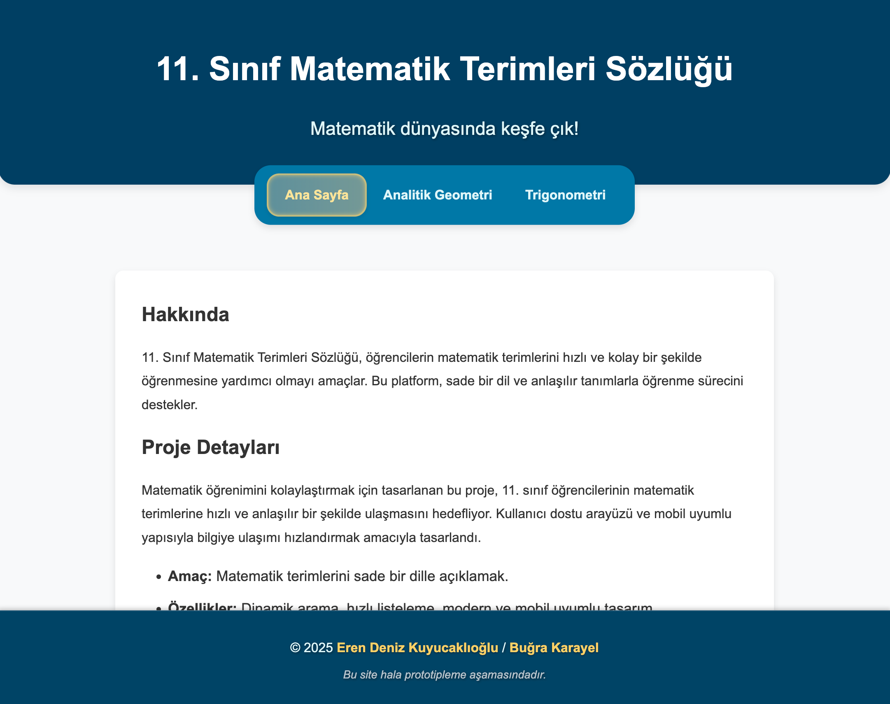
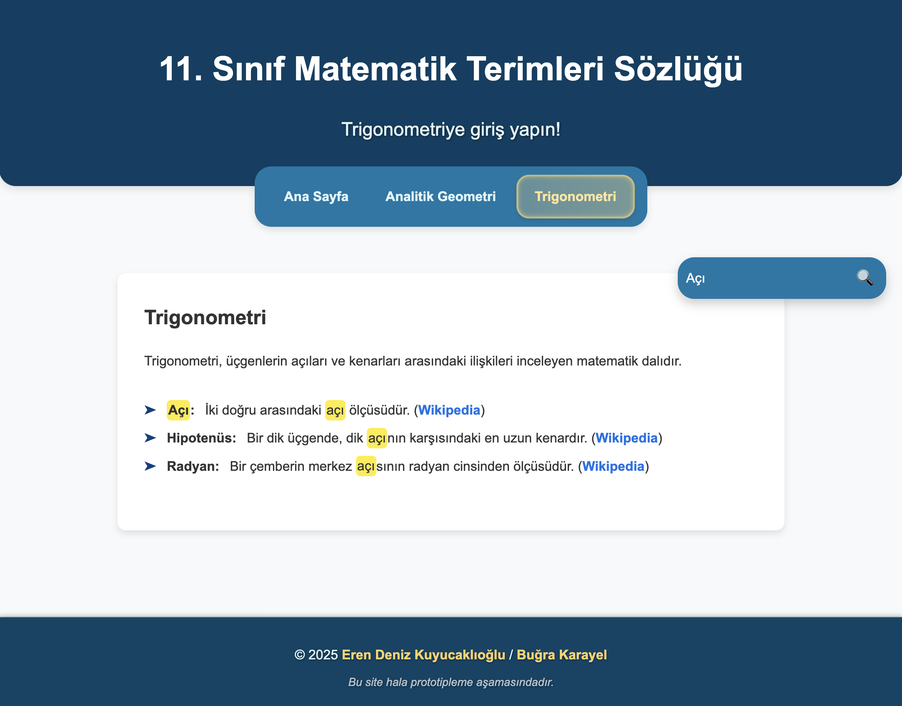

# 11. Sınıf Matematik Terimleri Sözlüğü

Bu proje, 11. sınıf öğrencilerinin matematik terimlerini hızlı ve etkili bir şekilde öğrenebilmesi için geliştirilmiş kullanıcı dostu bir platformdur. Kullanıcılar modern ve minimal bir arayüz eşliğinde terimlere kolayca ulaşabilir ve tanımlar üzerinde detaylı bilgi edinebilirler.

---

## Özellikler

- ✨ **Modern Kullanıcı Arayüzü**: Minimal ve düzenli bir tasarım.
- 💡 **Hover ve Glow Animasyonları**: Etkileşimli ve dikkat çekici animasyonlar.
- 📘 **Dinamik Arama Özelliği**: Hızlı ve filtrelenmiş sonuçlara ulaşım.

---

## Kurulum

### Gereksinimler
- **Web Tarayıcı**: Chrome, Firefox veya Safari gibi modern bir tarayıcı.
- **Yerel Sunucu**: `Live Server` ya da Python HTTP Server.

### Adımlar
1. **Depoyu Kopyalayın**:
   ```bash
   git clone https://github.com/erendenizk/matematik-terimleri.git
   cd matematik-terimleri
   ```

2. **Yerel Sunucuyu Çalıştırın**:
   - Python ile:
     ```bash
     python -m http.server
     ```
   - Alternatif olarak `Live Server` kullanabilirsiniz.

3. **Tarayıcıda Açın**:
   - Adres çubuğuna şu adresi girin:
     ```
     http://localhost:8000
     ```

---

## Proje Dosya Yapısı

```
web_test/
├── assets/
│   ├── files/
│   │   └── WebRapor.pdf
│   ├── screenshots/
│   │   ├── ana_sayfa.png
│   │   └── dinamik_arama.png
├── pages/
│   ├── page_!home.html
│   ├── page_analitik_geometri.html
│   ├── page_trigonometri.html
├── styles/
│   └── style.css
├── veriler/
│   ├── trigonometri.json
│   ├── analitik_geometri.json
├── app.js
├── LICENSE
├── README.md
```

---

## Ekran Görüntüleri

### Ana Sayfa


### Dinamik Arama


---

## Geliştirici Notları

### Katkıda Bulunma
Bu projeye katkıda bulunmak isterseniz aşağıdaki adımları izleyebilirsiniz:
1. **Fork**: Projeyi kendi hesabınıza fork'layın.
2. **Klonlama**: Projeyi yerel bilgisayarınıza klonlayın.
   ```bash
   git clone https://github.com/erendenizk/matematik-terimleri.git
   cd matematik-terimleri
   ```
3. **Geliştirme**: Yeni bir özellik ekleyin veya mevcut kod üzerinde düzenlemeler yapın.
4. **Değişiklikleri Gönderin**: Değişikliklerinizi GitHub üzerinde bir **Pull Request** olarak gönderin.

### Geliştirme Tavsiyeleri
- **Kod Stili**: Projede kullanılan kodların temiz, okunabilir ve düzenli olmasına dikkat edin.
- **Yapılandırma**: Yeni özellikler eklerken projenin mevcut yapısını bozmayın.
- **Geri Bildirim**: Yeni özellikler eklemeden önce `Issues` kısmında tartışma başlatabilirsiniz.

---

## Genel Kullanım ve Açık Kaynak Katkısı

### Kullanım Alanları
Bu proje eğitim amaçlı geliştirilmiştir ve şu alanlarda kullanılabilir:
- Matematik eğitimi veren öğretmenler tarafından ders materyali olarak.
- Öğrenciler için interaktif öğrenme platformu olarak.
- Açık kaynak katkı yapmayı öğrenmek isteyen geliştiriciler için başlangıç projesi.

### Açık Kaynak İlkesi
Bu proje, açık kaynak topluluğuna katkı sağlamak amacıyla geliştirilmiştir. Aşağıdaki konulara dikkat ederek projeye katkıda bulunabilirsiniz:
- **Öneriler ve Sorunlar**: `Issues` kısmında önerilerinizi veya karşılaştığınız sorunları paylaşabilirsiniz.
- **Yeni Özellikler**: Kullanıcı deneyimini iyileştirecek yeni fikirler sunabilirsiniz.
- **Hata Raporlama**: Herhangi bir hatayla karşılaşırsanız lütfen detaylı bir şekilde raporlayın.

---

## Geliştiriciler

Bu proje, aşağıdaki geliştiriciler tarafından geliştirilmiştir:

- **Eren Deniz Kuyucaklıoğlu** - [GitHub Profili](https://github.com/erendenizk)
- **Buğra Karayel** - [GitHub Profili](https://github.com/bugrakarayel)

Eğer sorularınız varsa ya da katkıda bulunmak istiyorsanız bize GitHub üzerinden ulaşabilirsiniz!

---

## Lisans

Bu proje MIT Lisansı ile lisanslanmıştır. Daha fazla bilgi için [LICENSE](../LICENSE) dosyasını inceleyebilirsiniz.
